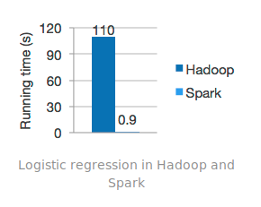
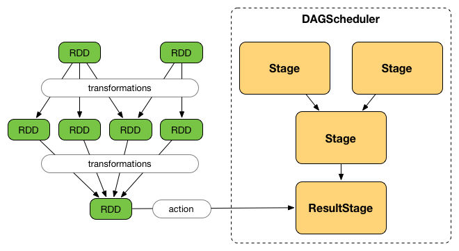

# Apache Dojo!
By: Camilo Sampedro


---

# Big Data

---

## Apache Hadoop
* Base technology for Apache Big Data technologies.
* Uses __MapReduce__ schema for its working.


---

## Apache Hadoop


---

## Apache Hadoop
* Composed by:
  * HDFS
  * Framework
  * Orchestator (Yarn)

---

## Apache Hadoop
* Used by:
  * Apache Spark
  * Apache Hive
  * Apache HBase
  * Apache Kylin
  * ...

---

## Apache Hadoop
* Very verbose, requires a class for __Map__, another for __Reduce__ and an external class to organize them.
* It also requires to use specific classes for primitives.
* And it requires to save to disk on EVERY step.


---

## Apache Spark
* Intends to make __MapReduce__ tasks easier and faster for the developer.



---

## Apache Spark
* It analyzes the tasks prompted by the user's code, and optimizes its execution.



---

## Apache Spark
* Supported languages:
  * Scala ( Developed on it `;)` )
  * Python
  * Java
  * R

---

## Apache Spark
* Has different libraries:
  * SQL and Dataframes
  * Streaming
  * MLlib
  * GraphX


---

## Scala
* _Functional_ and _object oriented_ language.
* Based on _Java_ and _Erlang_ mostly.


---

## Scala
* Strongly typesafe.
* Object inmutability.
* Code optimized on compilation.
* High productivity and quality (Lesser lines of code).

---

## Scala
```scala
val res1 = list.map(elem => elem * 2)
val res2 = list.filter(elem => elem % 2 == 0)
val res3 = list.reduce( (x, y) => x + y )
```

---

## Python
```python
res1 = map(lambda elem: elem * 2, list)
res2 = filter(lambda elem: elem % 2 == 0, list)
```

---

## Apache Hive
* Relational database on top of _Apache Hadoop_.
* Supports _Standard SQL_.
* Its query execution are performed with _MapReduce_ tasks.


---

## Apache HBase
* No relational database on top of _Apache Hadoop_.
* Its query execution are performed with _MapReduce_ tasks.
* Way faster than _Apache Hive_, but with more complexity.


---

## Cloudera
* Manager for several Apache Big Data applications:
  * Solr
  * Zookeeper
  * Spark
  * Hive
  * HBase
  * Hadoop
  * Hue


