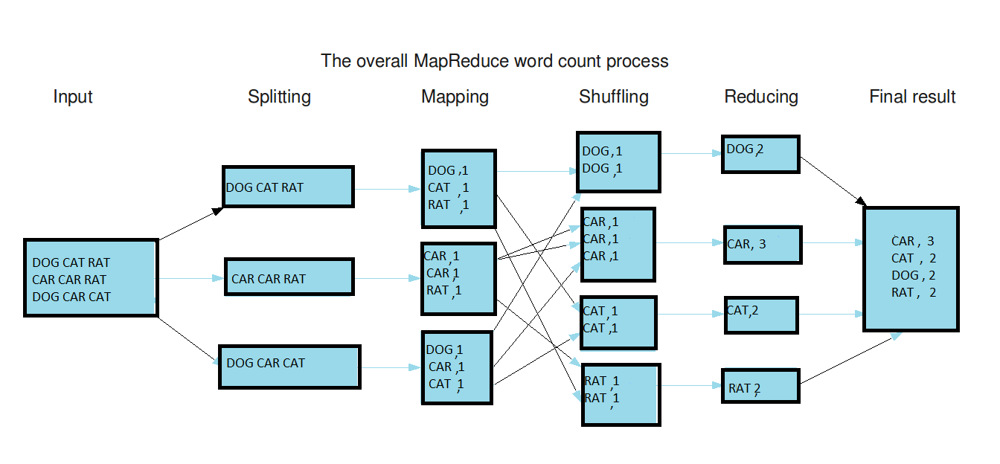

# Apache Dojo!
By: Camilo Sampedro


---

# Big Data

---

## Apache Hadoop
* Base technology for Apache Big Data technologies.
* Uses __MapReduce__ schema for its working.


---

## Apache Hadoop


---

## Apache Hadoop
* Composed by:
  * HDFS
  * Framework
  * Orchestator (Yarn)

---

## Apache Hadoop
* Used by:
  * Apache Spark
  * Apache Hive
  * Apache HBase
  * Apache Kylin
  * ...

---

## Apache Hadoop
* Very verbose, requires a class for __Map__, another for __Reduce__ and an external class to organize them.
* It also requires to use specific classes for primitives.
* And it requires to save to disk on EVERY step.


---

## Apache Spark
* Intends to make __MapReduce__ tasks easier and faster for the developer.


---

## Apache Spark
* It analyzes the tasks prompted by the user's code, and optimizes its execution.


---

## Apache Spark
* Supported languages:
  * Scala ( Developed on it `;)` )
  * Python
  * Java
  * R

---

## Apache Spark
* Has different libraries:
  * SQL and Dataframes
  * Streaming
  * MLlib
  * GraphX


---

## RDDs
__R__esilient __D__istributed __D__atasets__


---

## Dataframes
Structured RDDs


---

## SparkSQL
Execute SQL queries on Dataframes!

```scala
// Get data from Hive
val business = hiveContext.sql("SELECT * FROM stg_business")
business.cache() // Store it in memory
business.registerTempTable("business")
```

---

## Transformations
They can be executed on the same _MapReduce_ task

```scala
rdd.map(x => x * 2)
rdd.flatMap(x => x.split(" "))
rdd.filter(x => x.size() > 10)
rdd.distinct()
rdd.join(anotherRdd)
// ...
```

---

## Actions
Performs all the accumulated _MapReduce_ tasks

```scala
rdd.reduce(_ + _)
rdd.collect()
rdd.count()
rdd.first()
rdd.saveAsTextFile("/user/cloudera/result")
// ...
```

---

## Apache Spark
Execution modes: __master__:


---

## Scala
* _Functional_ and _object oriented_ language.
* Based on _Java_ and _Erlang_ mostly.


---

## Scala
* Strongly typesafe.
* Object inmutability.
* Code optimized on compilation.
* High productivity and quality (Lesser lines of code).

---

## Scala
```scala
val res1 = list.map(elem => elem * 2)
val res2 = list.filter(elem => elem % 2 == 0)
val res3 = list.reduce( (x, y) => x + y )
```

---

## Python
```python
res1 = map(lambda elem: elem * 2, list)
res2 = filter(lambda elem: elem % 2 == 0, list)
```

---

## Access to the server

```bash
ssh gero@172.16.1.70          
# Password: HXpPLA3M
sudo docker exec -it cloudera-example bash
spark-shell --master yarn     
# Or pyspark --master yarn
```

---

## Word Count



---

## Input

```scala
val input = sc.textFile("/user/cloudera/libros/*")
```

---

## Splitting and mapping

```scala
// Split the words of each line.
val splitted = input.flatMap(line => line.split(" "))

// Add a value 1 for each word key.
val mapped = splitted.map(word => (word, 1))
```

---

## Reduce by key

```scala
// Sum all the values for each word key
val wordCounts = mapped.reduceByKey((ac, v) => ac + v)
```

---

## Result

```scala
// Take the most frecuent words
wordCounts.map(r=>(r._2, r._1)).top(10)
```

---

## Big Data Pi calculation

```scala
val NUM_SAMPLES = 5000000       // Increment for better results
val count = sc.parallelize(1 to NUM_SAMPLES).filter {notUsed =>
  val x = math.random           // Two random numbers
  val y = math.random           // between 0 and 1
  x*x + y*y < 1                 // The ones inside the circle
}.count()
println(s"Pi is roughly ${4.0 * count / NUM_SAMPLES}")
```

---

## Apache Hive
* Relational database on top of _Apache Hadoop_.
* Supports _Standard SQL_.
* Its query execution are performed with _MapReduce_ tasks.


---

## Apache HBase
* No relational database on top of _Apache Hadoop_.
* Its query execution are performed with _MapReduce_ tasks.
* Way faster than _Apache Hive_, but with more complexity.


---

## Cloudera
* Manager for several Apache Big Data applications:
  * Solr
  * Zookeeper
  * Spark
  * Hive
  * HBase
  * Hadoop
  * Hue


